#### 1. Wprowadzenie
- celem projektu jest stworzenie aplikacji internetowej umożliwiającej wypożyczanie sprzętu rolniczego,
- sprzęt można zarezerwować cały dzień z nie większym niż 3 miesięcznym wyprzedzeniem,
- grupa docelową są lokalni rolnicy,
- aplikacja ma tworzyć harmonogram na zasadzie "kto pierwszy, ten lepszy".

#### 2. Funkcjonalność serwisu
- wyświetlanie listy wszystkich maszyn rolniczych,
- wyświetlanie listy rezerwacji maszyn rolniczych,
- sortowanie wyświetlanej listy maszyn i rezerwacji,
- tworzenie/anulowanie rezerwacji,
- logowanie i wylogowywanie użytkowników,
- podział na zwykłych użytkowników i administratorów,
- tworzenie/modyfikacja/usuwanie kont użytkowników,

#### 3. Uprawnienia i funkcjonalności z nimi związane
- funkcjonalności dostępne z poziomu **gościa** (niezalogowanego użytkownika):
	- wyświetlanie listy wszystkich maszyn rolniczych,
	- wyświetlanie listy rezerwacji maszyn rolniczych,
	- utworzenie konta użytkownika.
- funkcjonalności dostępne z poziomu **zalogowanego użytkownika**:
	- wyświetlanie listy wszystkich maszyn rolniczych,
	- wyświetlanie listy wszystkich rezerwacji maszyn rolniczych,
	- wyświetlanie listy swoich rezerwacji,
	- tworzenie/anulowanie rezerwacji,
	- wylogowanie się z aplikacji,
	- modyfikacja swojego konta.
- funkcjonalności dostępne z poziomu **administratora**:
	- tworzenie i usuwanie kont użytkowników,
	- wyświetlanie wszystkich kont użytkowników,
	- wyświetlenie listy wszystkich maszyn rolniczych,
	- wyświetlanie listy rezerwacji maszyn rolniczych,
	- dodawanie nowego sprzętu do bazy danych,
	- usuwanie sprzętu z bazy danych,

#### 4. Architektura i technologie
- warstwowa budowa (podział na część prezentacyjną, logiki biznesowej, danych):
	- zastosowanie wzorca **MVC** (Model, View, Controller).
- aplikacja oparta na **Node.js** i **Express.js**:
	- server side rendering.
- relacyjna baza danych w **sqlite**,
- zastosowanie **ORM Sequelize** do przetwarzania zapytań do bazy danych,
- do tworzenia widoków podstron wykorzystany jest język **PUG**,
- hasła użytkowników kodowanie są za pomocą funkcji haszującej **bcrypt**.

#### 5. Wymagane endpointy do prawidłowego funkcjonowania aplikacji
- pobieranie użytkowników z bazy danych:
	- *\[GET\] /users/{opcja_sortowania}*
- rejestracja:
	- *\[POST\] /users/register*
- logowanie:
	- *\[POST\] /users/login*
- wylogowanie:
	- *\[DELETE\] /users/logout*
- usuwanie konta użytkownika:
	- *\[DELETE\] /users/{user_id}*
- modyfikacja profilu użytkownika:
	- *\[POST\] /users/{user_id}*
- wyświetlenie danych użytkownika:
	- *\[GET\] /users/{user_id}*
- pobieranie rezerwacji z bazy danych:
	- *\[GET\] /reservations/{opcja_sortowania}*
- tworzenie rezerwacji:
	- *\[POST\] /reservations*
- anulowanie rezerwacji:
	- *\[DELETE\] /reservations/{reservation_id}*
- pobieranie informacji o sprzęcie z bazy danych:
	- *\[GET\] /machines/{opcja_sortowania}*
- dodanie nowego sprzętu do bazy danych:
	- *\[POST\] /machines*
- usunięcie sprzętu z bazy danych:
	- *\[POST\] /machines/{machine_id}*
- strona główna:
	-  *\[GET\] /*

#### 6. Makiety
- strona główna
	
- strona z wszystkimi maszynami rolniczymi
	- wersja dla Administratora
	 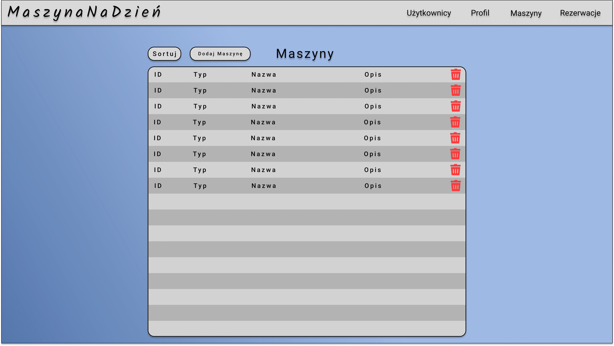
	- wersja dla Użytkownika
	 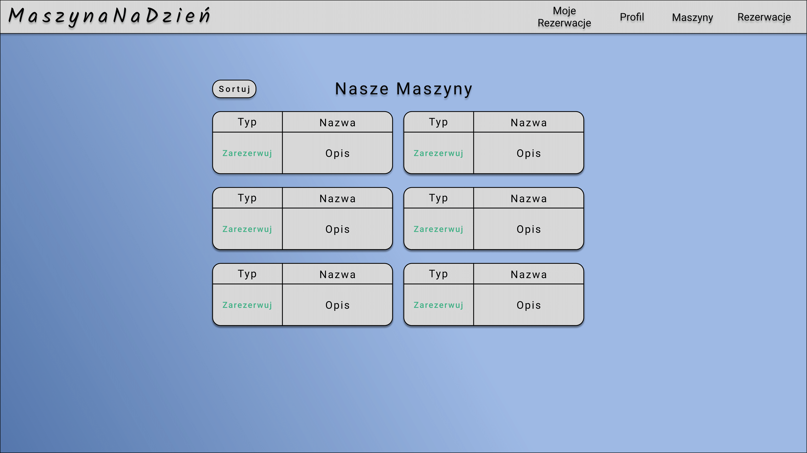
	- wersja dla Gościa
	 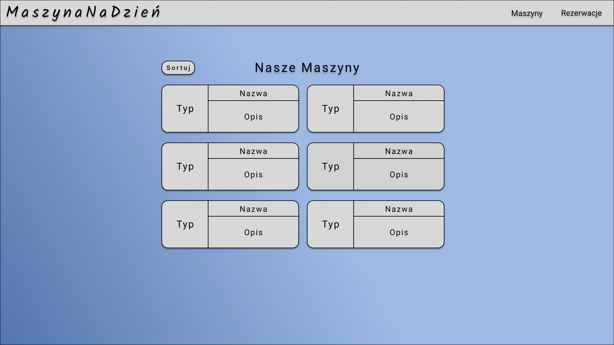
- strona z wszystkimi rezerwacjami
  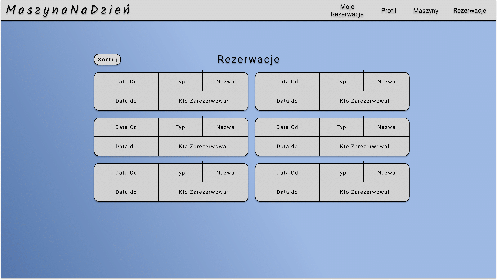
- strona z rezerwacjami użytkownika
  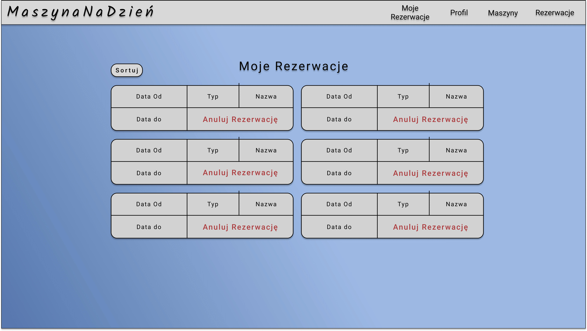

- strona umożliwiająca zarezerwowanie maszyny przez użytkownika
  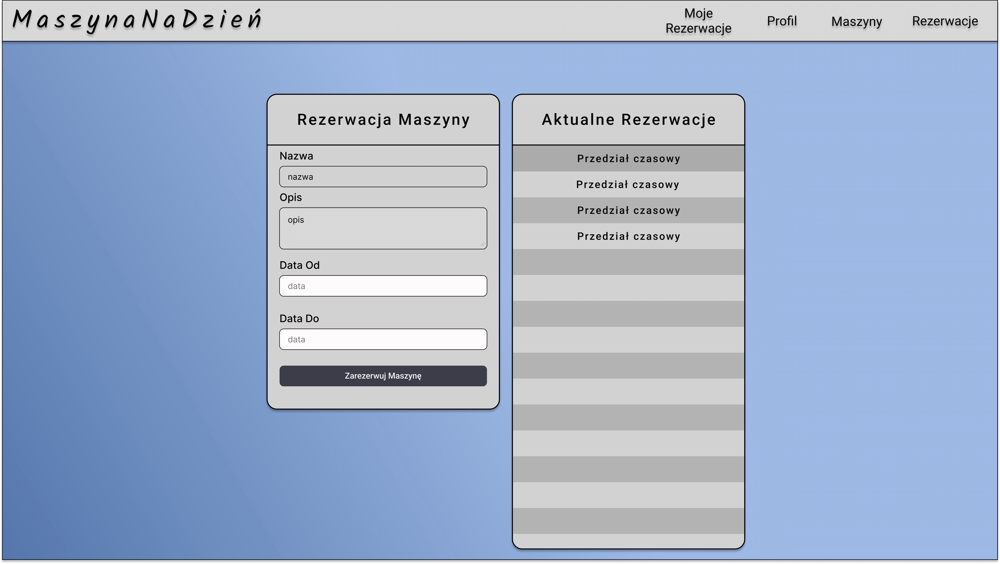

- strona z danymi zalogowanego użytkownika
  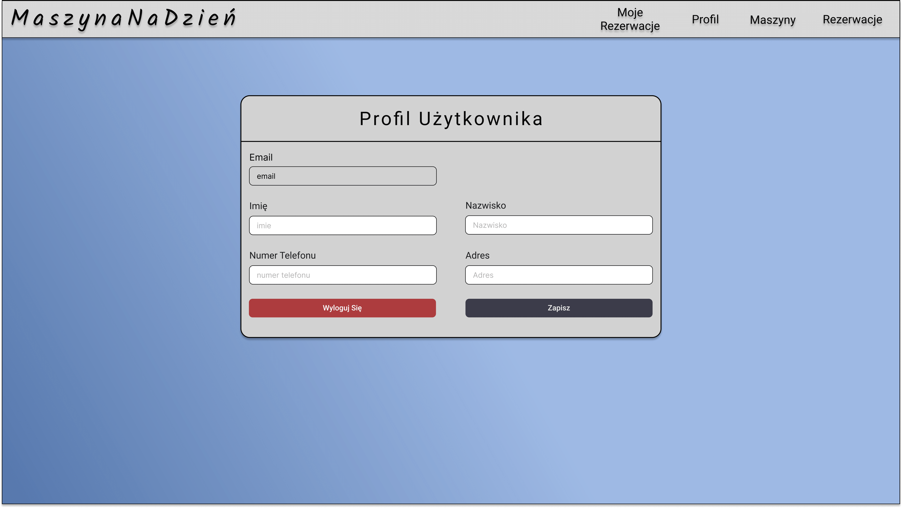
- strona do rejestracji
   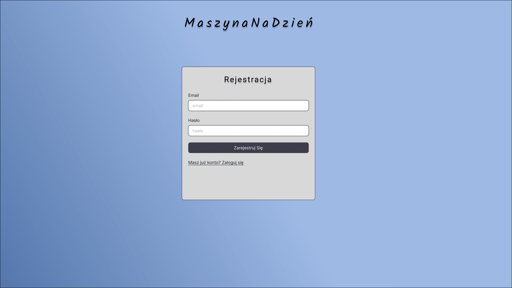
- strona do zalogowania się
  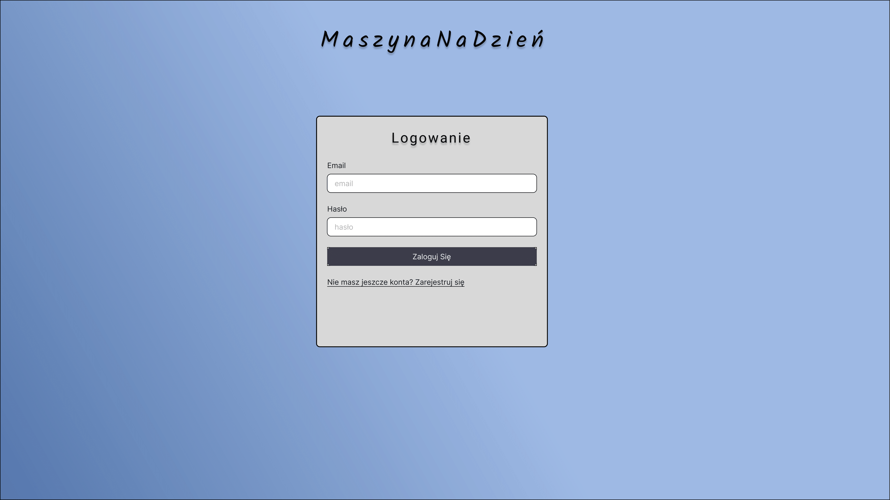
- strona wyświetlająca wszystkich użytkowników
  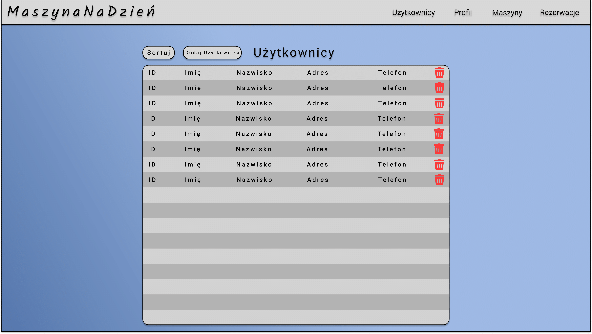
- strona umożliwiająca dodanie nowego sprzętu do bazy danych
  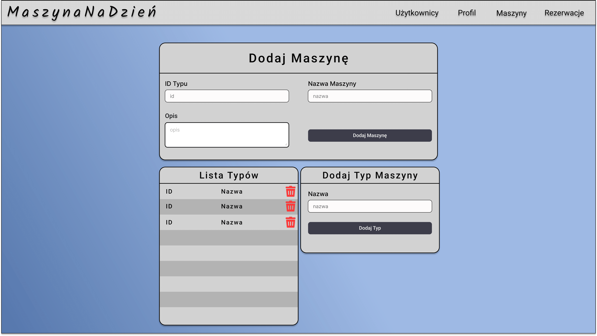
- strona umożliwiająca dodanie nowego konta użytkownika
  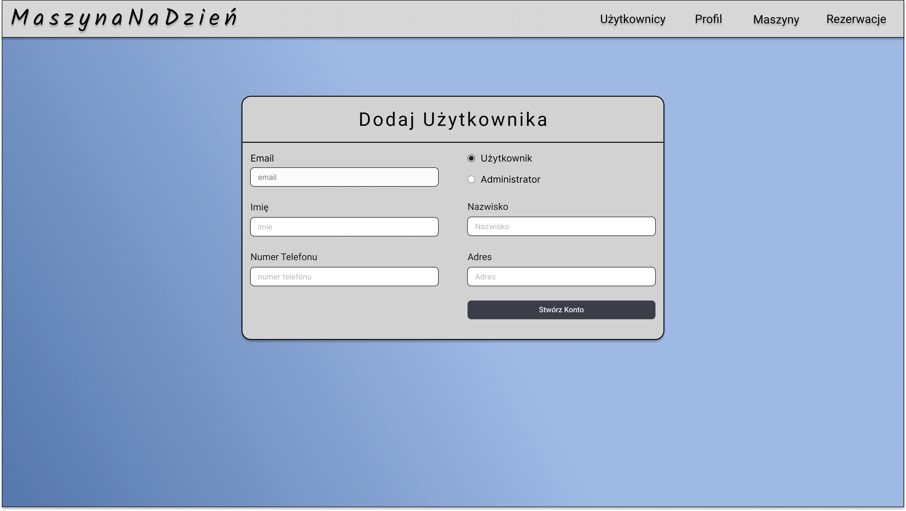

#### 7. Baza Danych
Przedstawione są tabele wykorzystane w bazie danych.

**Users**
- ID -> INTEGER, NOT NULL, PRIMARY KEY, AUTOINCREMET
- Name -> TEXT, NOT NULL
- Surname -> TEXT, NOT NULL
- Password -> TEXT, NOT NULL
- Email -> TEXT, NOT NULL
- Location -> TEXT
- Phone -> TEXT
- TypeID -> INTEGER, NOT NULL

**UserType**
- ID -> INTEGER, NOT NULL, PRIMARY KEY, AUTOINCREMET
- Type -> TEXT, NOT NULL

**Machines**
- ID -> INTEGER, NOT NULL, PRIMARY KEY, AUTOINCREMET
- Type -> INTEGER, NOT NULL
- Name -> TEXT, NOT NULL
- Description -> TEXT
	
**MachineType**
- ID -> INTEGER, NOT NULL, PRIMARY KEY, AUTOINCREMET
- Type -> TEXT, NOT NULL

**Reservations**
- ID -> INTEGER, NOT NULL, PRIMARY KEY, AUTOINCREMET
- UserID -> INTEGER, NOT NULL
- MachineID -> INTEGER, NOT NULL
- DateFrom -> TEXT, NOT NULL
- DateTo -> TEXT, NOT NULL
